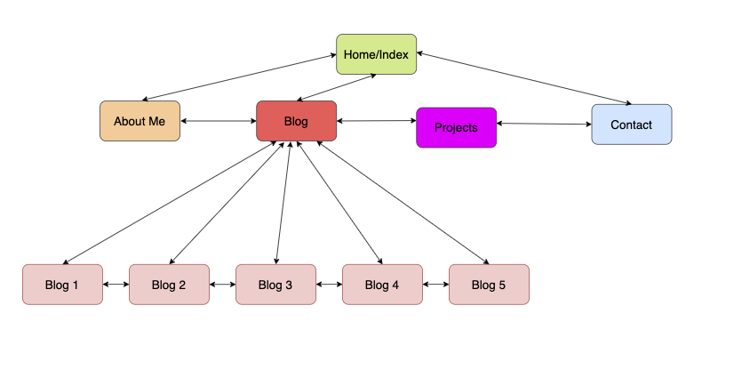
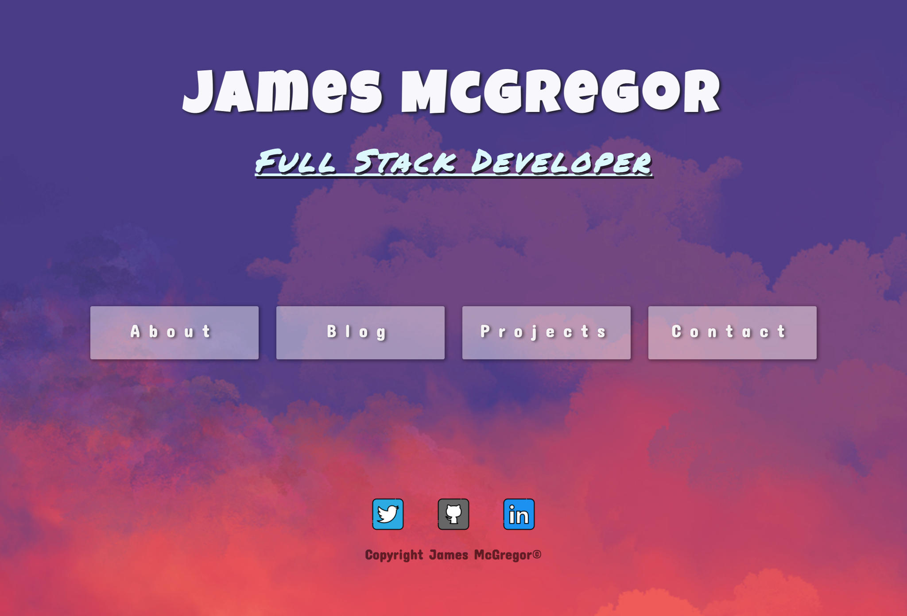
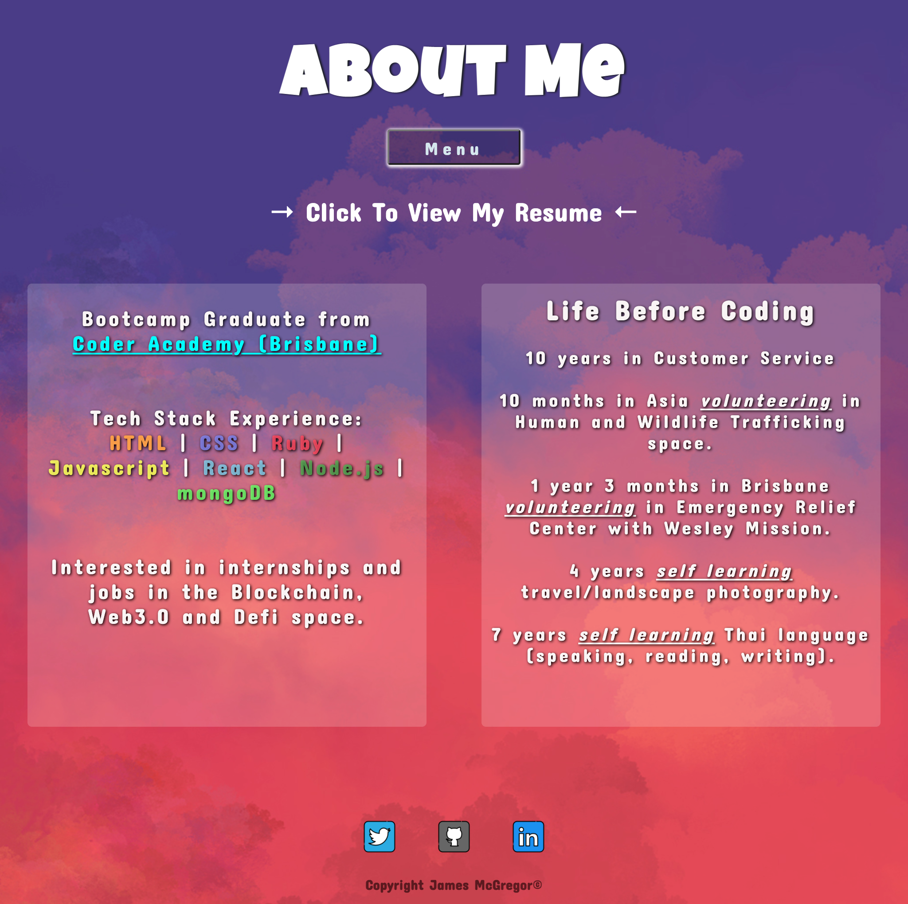
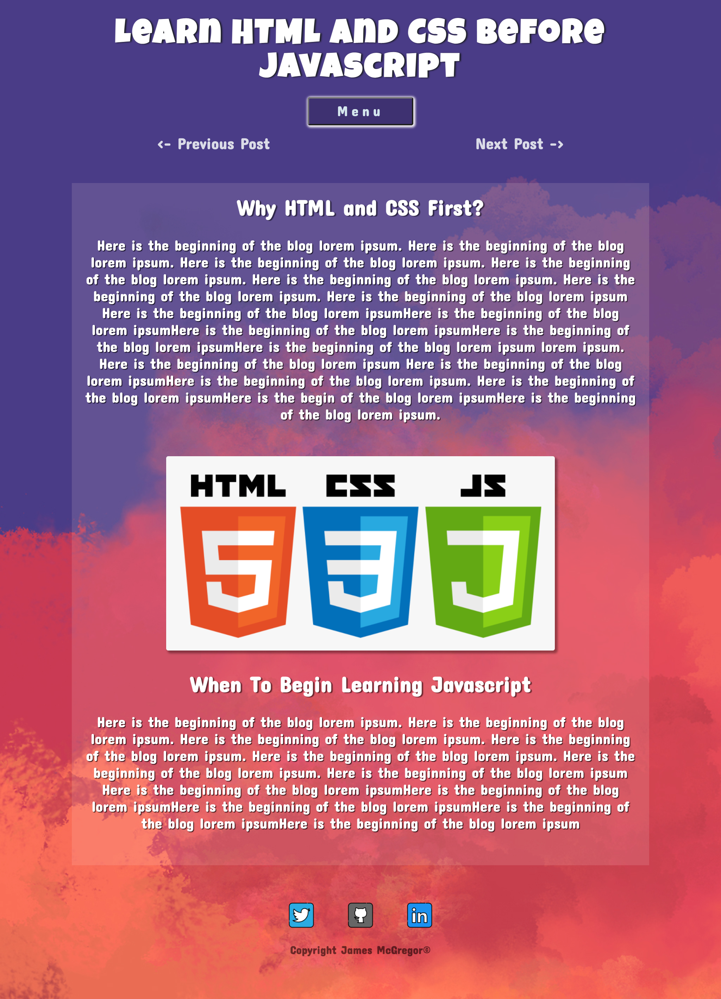
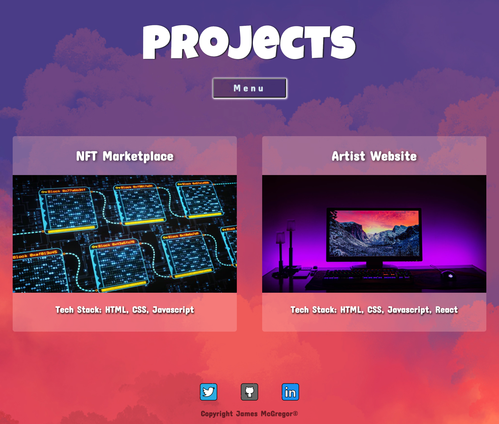
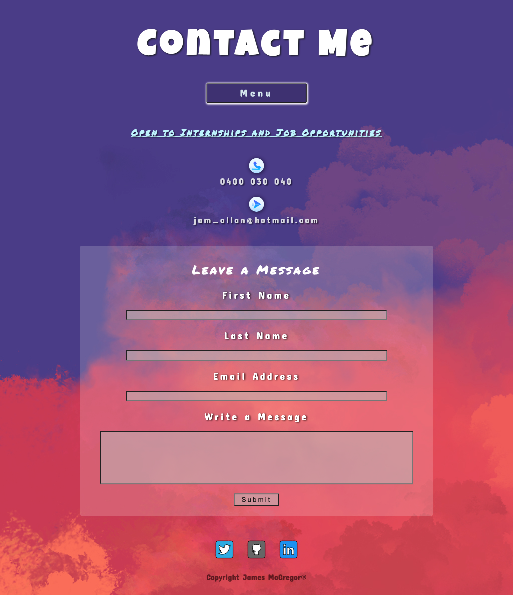

# JamesMcGregor_T1A2
*Important notes for Ashleigh/Lavanya/Markers at the bottom of the document.

# Links

Website: www.jamesmcdev.com

Github: www.github.com/james-mcgregor100/finalportfolio

# Purpose
The purpose of this portfolio website was to create a website to showcase myself as a Web Developer, and a professional in the field of IT. I was tasked with creating a website which was responsive, and which made us of flexbox and/or grid on each html page. Moreover, the purpose was to create a website that would showcase my abilities as a developer, and to grab the attention of the user who lands on my home page. Therefore, I set out to design a website that was both a professional website to show to potential employers, but also to show off my own unique personality through the colours, features, and overall styling deployed throughout the website. 

# Functionality/Features
The website features 10 individual html pages, including - 

1. Home Page
2. About Page
3. Blog Page
4. Blog Post 1
5. Blog Post 2
6. Blog Post 3
7. Blog Post 4
8. Blog Post 5
9. Projects
10. Contact Me

The website features a number of recurring components which are similarly styled, and positioned, on all html pages throughout the website. There are also individual components which are found on specific html pages throughout the site. These features are outlined below. 

## Component 1: Navigation Menu
The navigation menu is featured on every html page on the website. On the home page, the navigation menu is displayed horizontally, which reduces any excessive empty space on the page to ensure the reader's attention is fixated on the navigation bar. 

Aside from the home page, the navigation bar is used as a drop down menu just below the page heading at the top of every page. This allows for the reader to easily locate the menu, and allows the reader to easily navigate with ease to the other pages throughout the website. The dropdown menu feature has been used as a way to save space on the website, which allows for the main content on each page to grab the reader's attention.

The navigation menu was implemented and positioned on the page using flexbox on every page of the website. 

## Component 2: Footer (Social Media Buttons + Copyright)
The footer has been positioned at the bottom of every page throughout the website. It includes a group of three social media buttons which are linked to my social media profiles, including: Twitter, Github, and Linkedin. For the purposes of adding extra styling, and wanting to add an element of fun to the page, I added a very simple "hover" function to the social media buttons on every page. Once the user hovers their mouse over the buttons, the buttons do a very quick 360 degree spin (please refer to live website on desktop to experience this cool little function).

The copyright component was added in the footer directly below the social media buttons.

Flexbox was used on the footer to control its positiong on every page of the website. 

## Component 3: Blog Post Navigation Buttons
On the pages Blog 1, Blog 2, Blog 3, Blog 4, Blog 5, there are "previous post" and "next post" buttons located above the beginning of each blog post. These buttons have active page links and are an essential component of the page as it allows the user to switch back and forth between each individual blog post, without having to return to the main "Blog Home" page. This component has been added to increase accessibility, and to provide convenience for the user.

These navigation buttons were incorporated into the header, and flexbox was used to position and lay out the components.

## Component 4: Link to Resume Download
On the "About Me" page a line of text is inserted directly below the navigation menu at the top of the page to allow users to download and read my professional resume. This link is active, and it has arrows on either side of the text which indicate to the reader that they can click on this text link to view my resume. 

## Component 5: Image Links to Five Blog Posts
The "Blog" home page which is the landing page for the five individual blog posts, has five separate links, which are in the form of images and text. The five images chosen for each blog post are visually engaging, and they entice the reader to want to click onto the image link to read more about the blog post.

These five image links are positioned and aligned on the html page by using the grid tool. 

## Component 6: Images in Five Blog Posts
Images were placed in all five blog post pages to complement the paragraphs of text used to write the blog posts. These images helped to break up the paragraphs of text, and also helped to add context to the written content in the blog posts. Ultimately, the decision was made to insert these images for the purpose of keeping the user engaged and interested in the content on the blog post.

## Component 7: Contact Form and Submit Button
The Contact Page features a contact form component, which calls the user to action by filling out their details in the contact form and sending the website owner a message, if the user wishes to do so. 

At the bottom of the contact form a "submit" button component was added to allow the user to send off the contact form to the owner of the website. 

## Component 8: Mobile Phone and Email Address Buttons
On the Contact page there are two clickable buttons, for my mobile phone number and email address. By clicking these links the user will be able to make a direct phone call to me, or send an email to me directly. These links are incorporated in the website to provide the user with the various ways of contacting me, depending on their preferred method.

This component was put into the header, which is positioned and aligned on the html page using the flexbox tool. 

## Component 9: Images Used on Projects Page
Two images were used on the projects page to give an insight to the user about what my personal projects look like. These two images act as links, similar to the image links implemented on the Blog Home page. The images engage the user, and entice the user to want to click onto the image to find out more about the individual projects.

Due to the assignment brief and rubric not requiring to create individual project html pages, I have omitted these and left the images without active links at this point in time. 

For this component, the grid tool was used for aligning and positioning the images and text on the html page. 

## Styling:

### Fonts Used:
1. Concert One - https://fonts.google.com/specimen/Concert+One?query=concert+one
2. Luckiest Guy - https://fonts.google.com/specimen/Luckiest+Guy?query=luckiest+guy
3. Permanent Marker - https://fonts.google.com/specimen/Permanent+Marker?query=perman

These fonts were chosen as they were a perfect fit for the style of what I was trying to express. I wanted to create a webpage that was a professional portfolio, but at the same time, a website that had a fun and playful side to it. These fonts are not traditional, plain, block letter fonts. They are more rounded and curved, and look like they belong in cartoons, urban graffiti or pop culture media content for millenials. These fonts were a great fit for the style I was trying to achieve.

### Colors: 
For the common theme of my website, I chose it to have a common theme of a blue/purple/orange background, and a white foreground/text, with small sporadic highlights of black and aqua. These colours went well together during the planning stages of the website, and they were deployed on every page and styled in a similar manner.

I chose to have a colourful background, and to play colours of the background and text off each other throughout the website. The white text on every page helps to separate it from the colourful background, and I decided to use very slight text-shadows on a large portion of text on every page to provide more depth. This helped to add another slight layer of contrast, which ultimately allows the user to focus more easily on the text, and to not be distracted by the background. 

Many buttons and links throughout the website have hover functions which change the colour of the text or the button once a mouse hovers over it. This increases the interactivity between the user and the website, and allows for a more fun and engaging experience for the user. 

### Transparent Text and Image Boxes:
A low opacity box has been deployed behind many text boxes and images on most (if not all) pages of the website, which help to add another layer of contrast between the colourful background and the text in the foreground. This low opacity box was given a "whiteish" colour so it could complement the rest of the white styling on different headings, text, and buttons found on all pages. 

# Sitemap:
My website sitemap uses a very basic layout which features the five main pages of my website - the home page, about me page, blog page, the projects page, and the contact page. Through the use of a navigation button (available on all pages), the user is able to navigate back and forth between these five main pages with ease. 

Through the blog page (mentioned above), the user can also access a further five web pages which are five separate blog posts (as per the assignment rubric). Within these five pages, the user is able to easily navigate between all five blog posts with the help of conveniently placed "previous post" and "next post" buttons at the top of every blog post. Moreover, the navigation button (used in the four main pages) is also placed at the top of every blog post to allow the user to move back to any of the five main pages if they wish to do so. 

This basic but effective layout allows users to move back and forth between all pages throughout the website with minimal inconvenience.

# Screenshots:

## Page 1 - Home Page

## Page 2 - About Me
 

## Page 3 - Blog Home

## Page 4 - Blog 1

## Page 5 - Blog 2

## Page 6 - Blog 3

## Page 7 - Blog 4

## Page 8 - Blog 5

## Page 9 - Projects

## Page 10 - Contact Me

# Target audience:
The target audience for this website is a potential employer in the IT industry looking to engage myself as a developer for their company. While planning for, and desining this website, I had to be mindful of the level of knowledge and expectations of this IT professional.

I had to expect that the employer would have the following knowledge and expectations:

Technical knowledge relating to information technology, software development/coding, programming languages and development stacks
high expectations of professionalism and a positive work ethic.

# Tech stack:
The tech stack used throughout this website is a combination of HTML and CSS, and Github and Netlify were used to deploy the website. 

## HTML
HTML was used to produce the basic skeleton of the website, and to also include links, images, and text where necessary. Moreover, HTML was used to implement semantic elements throughout the website to to create meaning and to cater to accessibility. "Alt" tags were used where necessary to provide descriptions of images.

## CSS
CSS was used for all styling of the website, which included the background, fonts, text colour, text spacing, borders, padding, margins, text and box shadows, animations, width and height of all components, and, of course, flexbox and grid. 

If the reader opens up any of the CSS files used in this project, they will find that almost every single element contained in the 10 pages of the website have been heavily styled by CSS. 

## Github
Github was used as part of my website deployment process, and was also used to push my website to Github's online virtual repository. The online repository containts the source code and images, readme file, and it also keeps a history of all changes I have made on the website after each "push" to Github.

## Nelitfy
Netlify was used for the deployment of the website, and the actual source of the website came from Github. My Github repo was connected to my Netlify account, and Netlify used my Github repo to deploy the website.

# Other Tools

## Balsamiq 
Balsamiq was used for the planning stages of my portfolio website. I used Balsamiq to design the basic layout of my pages, and created wireframes for all pages on the website, with three wireframe sizes per page. The three wireframe sizes per page were for the mobile, tablet, and desktop views. This allowed me to plan how I would make my website responsive, before I even began coding in HTML and CSS.

## Canva
Canva was used to create the presentation.pdf file that is found in the assignment submission. Chose Canva over Microsoft Powerpoint as it offered more modern features, and the interface was more suitable for someone presenting about web design and web development. 

# Important Notes for Lavanya/Ashleigh/Markers
1. After presenting on Tuesday I was not sure if we needed to have a specific page showing my "projects" or "portfolio work" as a dev. So I decided to add another page to the website which fulfills this part of the brief, and it shows two mock up links for two mock up personal projects that I have "completed". 

    I have not added these into the slide deck PDF file as I understand that we weren't allowed to change the slide deck after the presentation had been completed. Therefore I would like to leave this note to let Ashleigh and Lavanya know that I have added this extra page in after the presentation, firstly for peace of mind, but secondly to try as hard as I can to fulfill as much of the brief and criteria as possible. 

2. I have tried to ensure that the code on all HTML pages is syntactically and semantically valid, where possible. I tried to minimize the use of the (div) element, and instead opted for semantically correct code such as (header) (footer) (section) (article), among others. 

    However, there are areas in the code where I have had to use (div), because I could not find any semantic HTML to replace it. For example, child elements of a (header), child elements of a (footer), child elements of a (article), and child elements of a (section). This may be due to my lack of experience with coding HTML, however I have tried to the best of my ability to minimize the use of the (div) element.

3. Please note that I opted for using the "desktop" sized screenshots in this readme document, and I have the other two sized screenshots (mobile and tablet) uploaded in the "docs" folder as per the requirements of the rubric. My reason for using the "desktop" size for the screenshots in this document is purely because the desktop screenshots are in landscape orientation, and take up significantly less room in the document than the extremely long vertical/portrait orientation mobile screenshots. 
